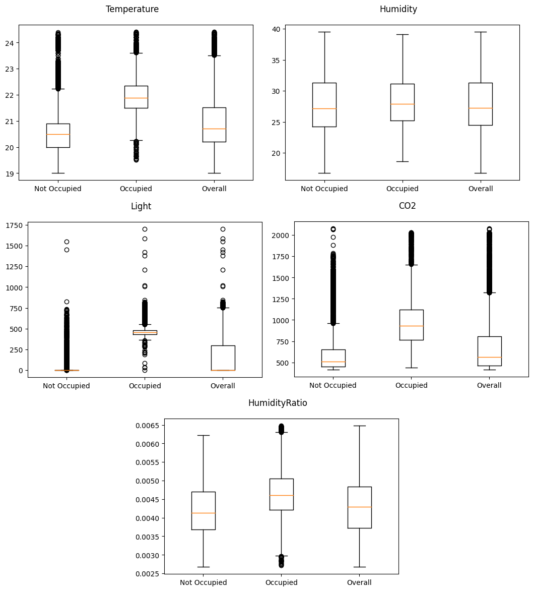

# Laporan Proyek Machine Learning - Ghifari Adil Ruchiyat

## 1. Domain Proyek

### Latar Belakang

Deteksi hunian (occupation detection) menentukan apakah suatu ruangan sedang dihuni oleh seseorang menggunakan data yang didapat dari sensor, misalnya sensor cahaya, suhu, kelembapan, atau CO2. Deteksi hunian sangat penting karena berdampak terhadap efisiensi energi, keamanan, dan kenyaman.

Dalam aspek efisiensi energi, deteksi hunian dapat membantu menghemat energi sebesar 10-40%[^1]. Misalnya, deteksi hunian dapat digunakan untuk mengontrol ventilasi, lampu, pemanas, dan pendingin pada bangunan. Lampu pada ruangan yang tidak dihuni dapat dimatikan secara otomatis, dan pendingin atau pemanas ruangan dapat diatur sesuai dengan jumlah orang di dalamnya. Hal ini membantu mengurangi konsumsi energi dan biaya operasional.

Dalam aspek keamanan, deteksi hunian dapat dimanfaatkan untuk penyelamatan dari bencana dan deteksi intrusi. Jika suatu gedung dengan sistem deteksi hunian mengalami bencana, misalnya bencana alam atau serangan militer, informasi tentang hunian gedung bisa didapat sebelum terjadi bencana[^2]. Oleh karenanya, penting untuk menentukan cara mendeteksi hunian dari sebuah bangunan dengan efektif.

Berbagai teknik telah diusulkan untuk mengatasi masalah ini. Teknik yang populer adalah dengan menggunakan sensor passive infrared (PIR)[^3] dan deteksi berbasis ultrasonic[^4]. Pendekatan lainnya meliputi menggunakan Wi-Fi untuk mendeteksi perangkat pada penghuni ruangan[^2] dan menggunakan backscattered light sensing, yang mendeteksi pantulan cahaya dari penghuni ruangan[^5]. Metode dengan menggunakan machine learning juga banyak diterapkan, misalnya dengan menggunakan model ML statistik pada data sensor[^6] maupun menggunakan kamera CCTV disertai algoritma deep learning[^7].

[^1]: K. Sun, Q. Zhao, and J. Zou, “A review of building occupancy measurement systems,” Energy Build., vol. 216, p. 109965, Jun. 2020, doi: 10.1016/j.enbuild.2020.109965.
[^2]: T. Fryza, T. Bravenec, and Z. Kohl, “Security and Reliability of Room Occupancy Detection Using Probe Requests in Smart Buildings,” in 2023 33rd International Conference Radioelektronika (RADIOELEKTRONIKA), Pardubice, Czech Republic: IEEE, Apr. 2023, pp. 1–6. doi: 10.1109/RADIOELEKTRONIKA57919.2023.10109085.
[^3]: V. Verma, . D., P. Dash, and Dr. V. Kumar, “Occupancy Based Lighting Control Strategy Using a Network of Motion Detection Sensors for Energy Conservation in a Building,” Int. J. RECENT TRENDS Eng. Res., vol. 6, no. 6, pp. 33–38, Jun. 2020, doi: 10.23883/IJRTER.2020.6043.H2IOM.
[^4]: A. Hammoud, M. Deriaz, and D. Konstantas, “UltraSense: A Self-Calibrating Ultrasound-Based Room Occupancy Sensing System,” Procedia Comput. Sci., vol. 109, pp. 75–83, 2017, doi: 10.1016/j.procs.2017.05.297.
[^5]: O. E. Ouahabi, C. Fragner, A. P. Weiss, and E. Leitgeb, “Occupancy Determination by Backscattered Visible Light Sensing,” in 2023 46th MIPRO ICT and Electronics Convention (MIPRO), Opatija, Croatia: IEEE, May 2023, pp. 280–285. doi: 10.23919/MIPRO57284.2023.10159964.
[^6]: L. M. Candanedo and V. Feldheim, “Accurate occupancy detection of an office room from light, temperature, humidity and CO 2 measurements using statistical learning models,” Energy Build., vol. 112, pp. 28–39, Jan. 2016, doi: 10.1016/j.enbuild.2015.11.071.
[^7]: S. Hu, P. Wang, C. Hoare, and J. O’Donnell, “Building Occupancy Detection and Localization Using CCTV Camera and Deep Learning,” IEEE Internet Things J., vol. 10, no. 1, pp. 597–608, Jan. 2023, doi: 10.1109/JIOT.2022.3201877.

## 2. Business Understanding

### Problem Statements
Berdasarkan latar belakang di atas, perlu dikembangkan sebuah sistem deteksi hunian untuk menjawab permasalahan berikut:
- Dari serangkaian fitur yang ada, fitur apa yang paling berpengaruh terhadap deteksi hunian?
- Berdasarkan fitur tertentu, apa hasil deteksi hunian yang tepat?

### Goals
Untuk menjawab pertanyaan tersebut, *predictive modelling* dibuat dengan tujuan atau *goals* sebagai berikut:
- Menentukan fitur yang paling berpengaruh terhadap deteksi hunian
- Membuat model *machine learning* yang dapat memprediksi hunian seakurat mungkin berdasarkan fitur-fitur yang ada

### Solution statements
Untuk mencapai tujuan tersebut, solusi yang perlu dilakukan adalah sebagai berikut:
- Membuat baseline model *machine learning* dengan algoritma Random Forest
- Melakukan hyperparameter tuning pada model baseline Random Forest

## 3. Data Understanding

Dataset yang digunakan adalah dataset [Occupancy Detection](https://archive.ics.uci.edu/dataset/357/occupancy+detection) oleh Luis Candanedo. Dataset ini memiliki 20560 sampel data dengan 7 fitur, yakni date, Temperature, Humidity, Light, CO2, HumidityRatio, dan Occupancy. Dataset sudah dibagi menjadi data training dan data testing. Data trainingnya sebanyak 8143 sampel, sedangkan data testingnya sebanyak 12417 sampel. 

### Deskripsi Variable

Variable-variable yang ada pada dataset adalah sebagai berikut:

- date: merupakan waktu data diperoleh
- Temperature: merupakan suhu ruangan dalam satuan Celsius
- Humidity: merupakan kelembapan relatif dalam satuan persentase
- Light: merupakan intensitas cahaya dalam satuan Lux
- CO2: merupakan konsentrasi molekul karbon dioksida di udara dalam satuan ppm
- HumidityRatio: merupakan fitur turunan dari Temperature dan Humidity dalam satuan kg-uap-air/kg-udara
- Occupancy: merupakan deteksi hunian ruangan, didapat dari gambar yang diambil setiap menitnya. 0 artinya tidak berpenghuni (Not Occupied), 1 artinya berpenghuni (Occupied)

Berikut adalah hasil `df.describe()` dari data:

|       |  Temperature |   Humidity   |     Light    |      CO2     | HumidityRatio |   Occupancy  |
|------:|:------------:|:------------:|:------------:|:------------:|:-------------:|:------------:|
| count | 20560.000000 | 20560.000000 | 20560.000000 | 20560.000000 |  20560.000000 | 20560.000000 |
|  mean |   20.906212  |   27.655925  |  130.756622  |  690.553276  |    0.004228   |   0.231031   |
|   std |   1.055315   |   4.982154   |  210.430875  |  311.201281  |    0.000768   |   0.421503   |
|   min |   19.000000  |   16.745000  |   0.000000   |  412.750000  |    0.002674   |   0.000000   |
|   25% |   20.200000  |   24.500000  |   0.000000   |  460.000000  |    0.003719   |   0.000000   |
|   50% |   20.700000  |   27.290000  |   0.000000   |  565.416667  |    0.004292   |   0.000000   |
|   75% |   21.525000  |   31.290000  |  301.000000  |  804.666667  |    0.004832   |   0.000000   |
|   max |   24.408333  |   39.500000  |  1697.250000 |  2076.500000 |    0.006476   |   1.000000   |

### Exploratory Data Analysis

Berikut adalah hasil analisis dari data tersebut:

1. Plot kemunculan kelas

    Berikut adalah plot kemunculan kelas 0 (tidak berpenghuni) dan 1 (berpenghuni) pada fitur Occupancy

    
    
    _Gambar 3.1: Plot distribusi kelas_

    Dari diagram ini, terlihat bahwa ada sekitar 16.000 data yang termasuk ke kelas 0 (Not Occupied), sementara hanya sekitar 4.000 data yang termasuk ke kelas 1 (Occupied). Ini menunjukkan bahwa dalam dataset ini, ada lebih banyak data Not Occupied dibandingkan dengan yang Occupied, dengan perbandingan sekitar 4:1. Informasi ini penting karena dapat mempengaruhi bagaimana model dilatih dan bagaimana performanya pada data yang tidak seimbang.

2. Plot histogram fitur

    Berikut adalah grafik histogram pada masing-masing fitur numerik pada data

    

     _Gambar 3.2: Grafik histogram fitur_

    Dari grafik diatas, didapat observasi sebagai berikut:

    - Pada fitur temperature, sebagian besar data berkumpul di sekitar 20-21 derajat
    - Pada fitur humidity, distribusi data lebih merata dengan beberapa puncak
    - Pada fitur light, sebaran data sangat rendah pada nilai tinggi, menunjukkan bahwa sebagian besar pengukuran cahaya berada pada kisaran rendah
    - Pada fitur CO2, pola serupa dengan fitur light, dengan konsentrasi tinggi pada nilai rendah
    - Pada fitur HumidityRatio, distribusi data juga merata dengan beberapa puncak

3. Plot histogram fitur tiap kelas

    Berikut adalah grafik histogram tiap fitur numerik pada data, dikelompokkan berdasarkan kelas.

    
    _Gambar 3.3: Grafik histogram fitur berdasarkan kelas_

    Dari grafik diatas, didapat observasi sebagai berikut:

    - Data temperature pada kelas Not Occupied rata-rata ada di antara 20 dan 21, sedangkan pada kelas Occupied, rata-ratanya ada di sekitar 22
    - Data light pada kelas Not Occupied sebagian besar ada di bawah 250, sedangkan pada kelas Occupied rata-ratanya ada di sekitar 500
    - Data CO2 pada kelas Not Occupied sebagian besar ada di bawah 750, sedangkan pada kelas Occupied datanya lebih merata pada rentang 500 sampai 1500
    - Tidak terlalu nampak perbedaan besar data Humidity Ratio dan Humidity pada kedua kelas selain perbedaan jumlah datanya, yang sudah terlihat dari plot jumlah kelas

4. Boxplot

    Berikut adalah diagram boxplot dari masing-masing fitur numerik, dikelompokkan berdasarkan kelas

    
    _Gambar 3.4: Grafik boxplot fitur berdasarkan kelas_

    Dari grafik diatas, didapat observasi sebagai berikut:

    - Pada fitur temperature dan CO2, terdapat beberapa outlier pada kedua kelas, baik pada kelas Not Occupied maupun kelas Occupied.
    - Pada fitur humidity, tidak ada outlier yang signifikan.
    - Pada fitur light, banyak outlier terlihat pada kedua kelas
    - Pada fitur CO2, outlier lebih sedikit pada kelas Occupied dibandingkan dengan kelas Not Occupied
    - Pada fitur Humidity Ratio, terdapat beberapa outlier pada kelas Occupied, namun tidak terlalu signifikan

5. Correlation Matrix

    Berikut adalah hasil Correlation Matrix dari data:

    
    _Gambar 3.5: Correlation matrix_

    Dari gambar diatas, terlihat bahwa fitur Light berkorelasi paling tinggi dengan fitur Occupancy dengan koefisien sebesar 0,91. Fitur Humidity berkorelasi paling rendah dengan koefisien sebesar 0,05.
    
## 4. Data Preparation

Preprocessing data di bawah ini dilakukan pada data training.

1. Drop fitur date, HumidityRatio, dan Humidity

    Fitur date adalah fitur timestamp unik dari masing-masing data. Fitur date didrop dengan tujuan agar model dapat melakukan deteksi hunian terlepas dari waktu kejadian dan hanya menggunakan fitur lain seperti cahaya. 
    Fitur HumidityRatio adalah fitur turunan dari humidity dan temperature, sehingga dapat didrop. Fitur Humidity juga didrop karena memiliki korelasi yang rendah denga fitur Occupancy.

2. Normalisasi data

3. Oversampling dengan metode SMOTE

    Data kelas occupied (kelas 1) jauh lebih sedikit dari data kelas not occupied (kelas 0). Hal ini dapat memberikan bias pada model. Untuk mencegahnya, dilakukan oversampling dengan menggunakan metode SMOTE. Metode SMOTE dipilih karena algoritmanya yang cukup sederhana dibandingkan metode lain, namun dapat mengurangi resiko overfitting yang muncul dari random oversampling.

## 5. Modeling

Model yang digunakan untuk deteksi hunian ini adalah model Random Forest Classifier. Random Forest adalah model ensemble yang terdiri dari beberapa model decision tree. Tiap model decision tree memiliki hyperparameter yang berbeda dan dilatih pada beberapa bagian (subset) data yang berbeda. Prediksi akhir diambil dari prediksi terbanyak pada seluruh tree. Model ini memiliki resiko overfitting yang rendah serta implementasinya yang cukup mudah.

Kelebihan dari algoritma ini adalah:
- Mampu menangani noise dan variasi dalam data
- Dapat menangani data non-linear dengan baik
- Risiko overfitting lebih rendah

Sedangkan kekurangan dari algoritma ini adalah:
- Sulit menangani data dengan fitur yang sangat banyak atau data berdimensi tinggi
- Membutuhkan banyak proses komputasi
- Waktu komputasi pada dataset berskala besar relatif lambat

Proses improvement pada model akan dilakukan dengan hyperparameter tuning menggunakan metode random search. Hyperparameter akan dipilih secara acak dari rentang berikut:

- n_estimator (jumlah tree pada model): 25 sampai 500
- max_depth (maksimal depth tiap tree): 3 sampai 20, atau None
- max_features (jumlah fitur pada setiap split): sqrt, log2, None
- min_samples_split : 2 sampai 6

Dari rentang di atas, beberapa model dibuat dengan hyperparameter acak. Kemudian, masing-masing model dilatih dan diuji akurasinya dengan cross-validation. Lalu dipilih model dengan akurasi terbaik.

Setelah membuat dan melatih model baseline dan model yang sudah di-tuned, dilakukan interpretasi model dengan mengukur *feature importances*, yakni mengukur fitur mana yang paling berpengaruh terhadap prediksi model. *Feature importances* dapat dihitung dengan memanggil method `feature_importances_` pada model.

Tahapan melakukan modellingnya adalah sebagai berikut:

1. Membuat baseline model

    Parameter *random_state* digunakan agar dapat memberikan hasil konsisten setiap kali menjalankan notebook

2. Melatih baseline model

    Model dilatih dengan training data yang sudah dilakukan SMOTE

3. Inisiasi Random Search

    paramRanges menyatakan rentang hyperparameter yang akan dipilih oleh Randomized Search. Parameter `n_iter` menyatakan berapa model yang akan diuji dengan hyperparameter yang berbeda. Disini, Random Search akan menguji 50 kombinasi hyperparameter yang berbeda.

4. Melakukan Random Search pada model Random Forest

    Random search juga menggunakan training data yang sudah dilakukan SMOTE
    Model yang memiliki performa terbaik setelah melakukan random search adalah yang memiliki parameter sebagai berikut:

    | Hyperparameter    | Value  |
    |:------------------|:------:|
    | n_estimators      | 166    |
    | min_samples_split | 5      |
    | max_features      | 'log2' |
    | max_depth         | 5      |

5. Interpretasi model

    Berikut adalah hasil perhitungan *feature importances* dari model baseline dan model yang sudah di-tuned:

    

    Dari diagram diatas, terlihat bahwa dalam kedua model, fitur light memiliki pengaruh paling signifikan dalam kedua model, sedangkan fitur CO2 dan temperature memiliki pengaruh yang relatif rendah. Hal ini menunjukkan bahwa intensitas cahaya berperan penting dalam deteksi hunian.

## 6. Evaluation

Metrik evaluasi model yang digunakan adalah sebagai berikut:

1. Confusion Matrix

    Confusion Matrix berisi prediksi model dibandingkan dengan yang seharusnya. Tiap baris menunjukkan kelas yang benar, dan tiap kolom menunjukkan prediksi yang dilakukan model. Contoh confusion matrix adalah sebagai berikut:

    

    Pada gambar diatas, ada 13 data yang berhasil diprediksi sebagai setosa, 10 data yang benar diprediksi sebagai versicolor, dan 9 data yang benar diprediksi sebagai virginica. Namun, ada 6 data yang diprediksi sebagai virginica, padahal seharusnya versicolor. Idealnya, hasil confusion matrix memiliki nilai yang besar di bagian diagonal utamanya.

2. Accuracy
    
    *Accuracy* atau akurasi adalah persentase hasil prediksi benar oleh model. *Accuracy* menunjukkan banyak prediksi benar dari keseluruhan prediksi. Semakin besar nilainya, semakin tinggi akurasinya. Rumus dari *Accuracy* adalah

    $$\text{Accuracy} = \frac{\text{total perdiksi benar}}{\text{total prediksi}}$$

3. F1 score

    F1 Score adalah metrik evaluasi yang menggabungkan nilai *precision* dan *recall*. Lebih tepatnya, F1 Score adalah rata-rata harmonik dari *precision* dan *recall*.

    *Precision* sendiri adalah metrik yang digunakan untuk mengukur kecocokan antara bagian data yang diambil dengan informasi yang dibutuhkan. *Precision* menunjukkan banyaknya prediksi positif dari model yang memang benar-benar positif dari keseluruhan prediksi positif. Rumus dari precision adalah

    $$\text{Precision} = \frac{TP}{TP + FP}$$

    dimana:

    - $TP$: *True Positive*: Banyaknya sampel yang benar diprediksi sebagai positif
    - $FP$: *False Positive*: Banyaknya sampel yang salah diprediksi sebagai positif

    Sedangkan *recall* adalah metrik yang digunakan untuk mengukur tingkat keberhasilan sistem dalam menemukan kembali sebuah informasi. *Recall* menunjukkan banyaknya prediksi positif yang berhasil diprediksi oleh model dari keseluruhan sampel positif. Rumus dari recall adalah 

    $$\text{Recall} = \frac{TP}{TP + FN}$$

    dimana:

    - $TP$: *True Positive*: Banyaknya sampel yang benar diprediksi sebagai positif
    - $FN$: *False Negative*: Banyaknya sampel yang salah diprediksi sebagai negatif

    Dari nilai precision dan recall diatas, didapat nilai F1 score sebagai berikut:

    $$\text{F1 Score} = 2\times\frac{\text{Precision} \times \text{Recall}}{\text{Precision} + \text{Recall}}$$

    Semakin besar nilai f1 scorenya, semakin bagus performa modelnya. F1 score umumnya digunakan pada permasalahan klasifikasi yang terdapat ketidakseimbangan kelas.

4. ROC-AUC score

    ROC-AUC score adalah skor yang didapat dari grafik ROC (Receiver Operating Characteristics). Grafik ROC sendiri adalah grafik yang didapat dengan memplot True Positive Rate (TPR) atau Recall dengan False Negative Rate (FPR) di setiap threshold yang berbeda.

    Rumus dari FPR adalah sebagai berikut:

    $$\text{FPR} = \frac{FP}{FP + TN}$$

    dimana:

    - $FP$: *False Positive*: Banyaknya sampel yang salah diprediksi sebagai positif
    - $TN$: *True Negative*: Banyaknya sampel yang benar diprediksi sebagai negatif

    Contoh grafik ROC adalah sebagai berikut:

    

    AUC (Area Under Curve) menunjukkan luas daerah di bawah grafik ROC. Nilainya memiliki rentang dari 0 hingga 1. Nilai AUC mendekati 1 menunjukkan performa yang baik, sedangkan nilai AUC sekitar 0.5 menandakan performa yang tidak lebih baik dari memilih kelas secara acak. Nilai AUC dibawah 0.5 menandakan performa yang lebih buruk dari prediksi acak.

Dibawah adalah nilai accuracy, F1-Score, serta ROC-AUC score dari model baseline dan model yang sudah dilakukan hyperparameter tuning. Nilai metrik didapat menggunakan data testing.

|           | Baseline |   Tuned  |
|----------:|:--------:|:--------:|
| Accuracy  | 0.970685 | 0.988967 |
|  F1 Score | 0.940328 | 0.977734 |
|  ROC-AUC  | 0.963449 | 0.991250 |

Berikut adalah diagram dari tabel diatas:

Dari data diatas, terlihat bahwa model baseline memiliki akurasi dan f1 score yang lebih baik dari model yang di-tune pada data training. Namun pada data test, model baseline memiliki akurasi dan f1 score yang lebih buruk dari model yang di-tune

Berikut adalah diagram confusion matrix menggunakan dataset test dari masing-masing model:

Dari diagram diatas, didapat observasi berikut:

- Model Baseline:

    - True Negative (TN): 9005 sampel benar diprediksi sebagai not occupied.
    - False Positive (FP): 391 sampel salah diprediksi sebagai occupied.
    - False Negative (FN): 64 sampel salah diprediksi sebagai not occupied.
    - True Positive (TP): 2957 sampel benar diprediksi sebagai occupied.

- Model Tuned:

    - True Negative (TN): 9287 sampel benar diprediksi sebagai not occupied.
    - False Positive (FP): 109 sampel salah diprediksi sebagai occupied.
    - False Negative (FN): 16 sampel salah diprediksi sebagai not occupied.
    - True Positive (TP): 3005 sampel benar diprediksi sebagai occupied.

Dari diagram ini, kita dapat melihat bahwa model yang sudah di-tune memiliki performa yang lebih baik dibandingkan dengan Model Baseline, dengan jumlah kesalahan prediksi yang lebih sedikit. Selain itu, jumlah False Positive cenderung lebih besar daripada jumlah False Negative.

Dari hasil evaluasi diatas, didapat bahwa hyperparameter tuning dapat meningkatkan performa pada model Random Forest Classifier, terutama dalam kasus deteksi hunian.

## Referensi: