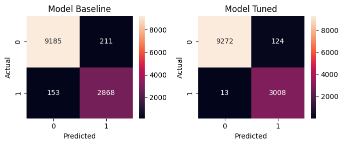

# Laporan Proyek Machine Learning - Ghifari Adil Ruchiyat

## 1. Domain Proyek

### Latar Belakang

Deteksi hunian (*occupation detection*) menentukan apakah suatu ruangan sedang dihuni oleh seseorang menggunakan data yang didapat dari sensor, misalnya sensor cahaya, suhu, kelembapan, atau CO2. Deteksi hunian merupakan komponen penting di bidang Internet of Things (IoT), terutama dalam konteks *smart building*. Deteksi hunian sangat penting karena berdampak terhadap efisiensi energi, keamanan, dan kenyamanan. Misalnya, deteksi hunian dapat digunakan untuk mengontrol ventilasi, lampu, pemanas, dan pendingin pada bangunan, sehingga dapat mengurangi penggunaan energi listrik. Deteksi hunian dapat juga digunakan untuk mendeteksi kehadiran orang yang masuk ke dalam ruangan atau bangunan tanpa izin. Oleh karenanya, penting untuk menentukan cara mendeteksi hunian dari sebuah bangunan dengan efektif.

Berbagai solusi telah diusulkan untuk mengatasi masalah ini. Salah satu pendekatannya melibatkan penggunaan berbagai sensor, seperti sensor CO2, kelembaban, suhu, dan sensor cahaya. Sensor ini digunakan bersama dengan berbagai algoritma, seperti algortima berbasis data dan algoritma analitik. Teknik pembelajaran mesin atau *machine learning* juga digunakan untuk mendeteksi hunian menggunakan data sensor, misalnya dengan algoritma *decision trees*, *random forest*, *SVM*, serta *k-nearest neighbors*. Dengan memanfaatkan pendekatan ini, dimungkinkan untuk secara akurat menentukan hunian lingkungan dalam suatu ruangan, sehingga meningkatkan efisiensi energi dan keamanan bangunan.

### Referensi Terkait

Sebuah studi berjudul ["Accurate occupancy detection of an office room from light, temperature, humidity and CO2 measurements using statistical learning models"](https://www.sciencedirect.com/science/article/abs/pii/S0378778815304357) oleh Luis M. Candanedo dan Veronique Feldheim melakukan deteksi hunain dengan menggunakan tiga model, yakni Linear Discriminant Analysis, Classification and Regression Trees, dan Random Forest. Hasilnya menunjukkan akurasi yang tinggi dari ketiga model tersebut.

Studi lain berjudul ["Building Occupancy Detection and Localization Using CCTV Camera and Deep Learning"](https://ieeexplore.ieee.org/document/9868085) oleh Shushan Hu et al menggunakan data dari kamera CCTV dan model deep learning untuk mendeteksi hunian dari ruangan. Model juga berhasil untuk mendeteksi jumlah orang pada ruangan, serta lokasinya di ruangan tersebut. 

## 2. Business Understanding

### Problem Statements
Berdasarkan latar belakang di atas, perlu dikembangkan sebuah sistem deteksi hunian untuk menjawab permasalahan berikut:
- Dari serangkaian fitur yang ada, fitur apa yang paling berpengaruh terhadap deteksi hunian?
- Berdasarkan fitur tertentu, apa hasil deteksi hunian yang tepat?

### Goals
Untuk menjawab pertanyaan tersebut, *predictive modelling* dibuat dengan tujuan atau *goals* sebagai berikut:
- Menentukan fitur yang paling berpengaruh terhadap deteksi hunian
- Membuat model *machine learning* yang dapat memprediksi hunian seakurat mungkin berdasarkan fitur-fitur yang ada

### Solution statements
Untuk mencapai tujuan tersebut, solusi yang perlu dilakukan adalah sebagai berikut:
- Membuat baseline model *machine learning* dengan algoritma Random Forest
- Melakukan hyperparameter tuning pada model baseline Random Forest

## 3. Data Understanding

Dataset yang digunakan adalah dataset [Occupancy Detection](https://archive.ics.uci.edu/dataset/357/occupancy+detection) oleh Luis Candanedo. Dataset ini memiliki 20560 sampel data dengan 7 fitur, yakni date, Temperature, Humidity, Light, CO2, HumidityRatio, dan Occupancy. Sumber dataset sudah membagi dataset menjadi data training dan data testing. Data trainingnya sebanyak 8143 sampel, sedangkan data testingnya sebanyak 12417 sampel. 

### Deskripsi Variable

Variable-variable yang ada pada dataset adalah sebagai berikut:

- date: merupakan waktu data diperoleh
- Temperature: merupakan suhu ruangan dalam satuan Celsius
- Humidity: merupakan kelembapan relatif dalam satuan persentase
- Light: merupakan intensitas cahaya dalam satuan Lux
- CO2: merupakan konsentrasi molekul karbon dioksida di udara dalam satuan ppm
- HumidityRatio: merupakan fitur turunan dari Temperature dan Humidity dalam satuan kg-uap-air/kg-udara
- Occupancy: merupakan deteksi hunian ruangan, didapat dari gambar yang diambil setiap menitnya. 0 artinya tidak berpenghuni (Not Occupied), 1 artinya berpenghuni (Occupied)

Berikut adalah hasil `df.describe()` dari data:


### Exploratory Data Analysis

Berikut adalah hasil analisis dari data tersebut:

1. Plot kemunculan kelas

    Berikut adalah plot kemunculan kelas 0 (tidak berpenghuni) dan 1 (berpenghuni) pada fitur Occupancy

    

    Terlihat bahwa kelas Occupied lebih sedikit dari kelas Not Occupied. Hal ini dapat mempengaruhi model.

2. Plot histogram fitur

    Berikut adalah grafik histogram pada masing-masing fitur numerik pada data

    

    Dari grafik diatas, terlihat bahwa fitur Light dan CO2 sebagian besar berukuran kecil - fitur Light banyak di bawah 100, dan CO2 banyak di bawah 600. Fitur lainnya memiliki persebaran yang lebih normal

3. Plot histogram fitur tiap kelas

    Berikut adalah grafik histogram tiap fitur numerik pada data, dikelompokkan berdasarkan kelas.

    

    Dari grafik diatas, didapat observasi sebagai berikut:

    - Data temperature pada kelas Not Occupied rata-rata ada di antara 20 dan 21, sedangkan pada kelas Occupied, rata-ratanya ada di sekitar 22
    - Data light pada kelas Not Occupied sebagian besar ada di bawah 250, sedangkan pada kelas Occupied rata-ratanya ada di sekitar 500
    - Data CO2 pada kelas Not Occupied sebagian besar ada di bawah 750, sedangkan pada kelas Occupied datanya lebih merata pada rentang 500 sampai 1500
    - Tidak terlalu nampak perbedaan besar data Humidity Ratio dan Humidity pada kedua kelas selain perbedaan jumlah datanya, yang sudah terlihat dari plot jumlah kelas

4. Boxplot

    Berikut adalah diagram boxplot dari masing-masing fitur numerik, dikelompokkan berdasarkan kelas

    

    Dari grafik diatas, didapat observasi sebagai berikut:

    - Pada fitur temperature dan CO2, terdapat beberapa outlier pada kedua kelas, baik pada kelas Not Occupied maupun kelas Occupied.
    - Pada fitur humidity, tidak ada outlier yang signifikan.
    - Pada fitur light, banyak outlier terlihat pada kedua kelas
    - Pada fitur CO2, outlier lebih sedikit pada kelas Occupied dibandingkan dengan kelas Not Occupied
    - Pada fitur Humidity Ratio, terdapat beberapa outlier pada kelas Occupied, namun tidak terlalu signifikan

5. Correlation Matrix

    Metode Pearson, yang merupakan default pada `df.corr()`, umumnya digunakan untuk memeriksa korelasi dari dua fitur kontinyu. Pada data yang digunakan, fitur occupancy merupakan fitur diskret (0 dan 1), sedangkan fitur lainnya adalah fitur kontinyu, sehingga kurang cocok menggunakan metode Pearson.

    Disini, metode tes korelasi yang digunakan adalah metode *Cramer's V* atau koefisien Cramer yang lebih sesuai untuk kondisi tersebut. Koefisien Cramer dapat dicari dengan rumus

    

    - χ2 = Nilai statistik Chi-square
    - n = Jumlah observasi
    - r = Jumlah baris tabel kontingensi
    - c = Jumlah kolom tabel kontingensi

    Koefisien bernilai mendekati 1 menandakan korelasi yang kuat, sedangkan koefisien bernilai mendekati 0 menandakan korelasi yang lemah.

    Dengan menggunakan metode tersebut, didapat Correlation Matrix sebagai berikut:

    

    Dari gambar diatas, terlihat bahwa fitur Light berkorelasi paling tinggi dengan fitur Occupancy dengan koefisien sebesar 0,93. Fitur Humidity berkorelasi paling rendah dengan koefisien sebesar 0,52. Semua fitur numerik memiliki koefisien diatas 0,5.
    
## 4. Data Preparation

Preprocessing data di bawah ini dilakukan pada data training.

1. Drop fitur HumidityRatio dan date

    Fitur date adalah fitur timestamp unik dari masing-masing data. Fitur date di didrop dengan tujuan agar model dapat melakukan deteksi hunian terlepas dari waktu kejadian dan hanya menggunakan fitur lain seperti cahaya. Sedangkan fitur HumidityRatio adalah fitur turunan dari humidity dan temperature, sehingga dapat didrop pula

    ```py
    dfTrain = df1.drop(columns=['date', 'HumidityRatio'])
    ```

2. Oversampling dengan metode SMOTE

    Data kelas occupied (kelas 1) jauh lebih sedikit dari data kelas not occupied (kelas 0). Hal ini dapat memberikan bias pada model. Untuk mencegahnya, dilakukan oversampling dengan menggunakan metode SMOTE

    ```py
    xTrain = dfTrain.drop(columns=('Occupancy'))
    yTrain = dfTrain.Occupancy

    smote = SMOTE(random_state=1)
    xTrain, yTrain = smote.fit_resample(xTrain, yTrain)
    ```

## 5. Modeling

Model yang digunakan untuk deteksi hunian ini adalah model Random Forest Classifier. Random Forest adalah model ensemble yang terdiri dari beberapa model decision tree. Tiap model decision tree memiliki hyperparameter yang berbeda dan dilatih pada beberapa bagian (subset) data yang berbeda. Prediksi akhir diambil dari prediksi terbanyak pada seluruh tree.

Kelebihan dari algoritma ini adalah:
- Mampu menangani noise dan variasi dalam data
- Dapat menangani data non-linear dengan baik
- Risiko overfitting lebih rendah
- Akurasi yang lebih baik daripada algoritma klasifikasi lainnya

Sedangkan kekurangan dari algoritma ini adalah:
- Sulit menginterpretasikan pengaruh setiap fitur dalam membuat keputusan
- Sulit menangani data dengan fitur yang sangat banyak atau data berdimensi tinggi
- Membutuhkan banyak proses komputasi
- Waktu komputasi pada dataset berskala besar relatif lambat

Proses improvement pada model akan dilakukan dengan hyperparameter tuning menggunakan metode random search. Hyperparameter akan dipilih secara acak dari rentang berikut:

- n_estimator (jumlah tree pada model): 100, 125, 150, 175, 200, 225, dst. sampai 500
- max_depth (maksimal depth tiap tree): 3 sampai 20

Tahapan melakukan modellingnya adalah sebagai berikut:

1. Membuat baseline model

    Parameter *random_state* digunakan agar dapat memberikan hasil konsisten setiap kali menjalankan notebook

    ```py
    baselineModel = RandomForestClassifier(random_state=1)
    ```

2. Melatih baseline model

    Model dilatih dengan training data yang sudah dilakukan SMOTE

    ```py
    baselineModel.fit(xTrain, yTrain)
    ```

3. Inisiasi Random Search

    paramRanges menyatakan rentang hyperparameter yang akan dipilih oleh Randomized Search. Parameter `n_iter` menyatakan berapa model yang akan diuji dengan hyperparameter yang berbeda. Disini, Random Search akan menguji 20 kombinasi hyperparameter yang berbeda.

    ```py
    paramRanges = {
        'n_estimators': range(100, 501, 25),
        'max_depth': range(3, 20),
    }

    search = RandomizedSearchCV(RandomForestClassifier(random_state=1), paramRanges, random_state=1, n_iter=20)
    ```

4. Melakukan Random Search pada model Random Forest

    Random search juga menggunakan training data yang sudah dilakukan SMOTE

    ```py
    search.fit(xTrain, yTrain)
    ```

    Hasil parameter terbaik pada random search tersebut didapat dengan kode berikut:

    ```py
    search.best_params_
    ```

    Hasilnya adalah sebagai berikut:

    ```
    {'n_estimators': 375, 'max_depth': 3}
    ```

    Model yang memiliki performa terbaik setelah melakukan random search adalah yang memiliki parameter `n_estimators` sebesar 375 dan `max_depth` sebesar 3.

## 6. Evaluation

Metrik evaluasi model yang digunakan adalah sebagai berikut:

1. Confusion Matrix

    Confusion Matrix berisi prediksi model dibandingkan dengan yang seharusnya. Tiap baris menunjukkan kelas yang benar, dan tiap kolom menunjukkan prediksi yang dilakukan model. Contoh confusion matrix adalah sebagai berikut:

    

    Pada gambar diatas, ada 13 data yang berhasil diprediksi sebagai setosa, 10 data yang benar diprediksi sebagai versicolor, dan 9 data yang benar diprediksi sebagai virginica. Namun, ada 6 data yang diprediksi sebagai virginica, padahal seharusnya versicolor. Idealnya, hasil confusion matrix memiliki nilai yang besar di bagian diagonal utamanya.

2. Accuracy
    
    *Accuracy* atau akurasi adalah persentase hasil prediksi benar oleh model. *Accuracy* menunjukkan banyak prediksi benar dari keseluruhan prediksi. Semakin besar nilainya, semakin tinggi akurasinya. Rumus dari *Accuracy* adalah

    

3. F1 score

    F1 Score adalah metrik evaluasi yang menggabungkan nilai *precision* dan *recall*. Lebih tepatnya, F1 Score adalah rata-rata harmonik dari *precision* dan *recall*.

    *Precision* sendiri adalah metrik yang digunakan untuk mengukur kecocokan antara bagian data yang diambil dengan informasi yang dibutuhkan. *Precision* menunjukkan banyaknya prediksi positif dari model yang memang benar-benar positif dari keseluruhan prediksi positif. Rumus dari precision adalah

    

    dimana:

    - TP: *True Positive*: Banyaknya sampel yang benar diprediksi sebagai positif
    - FP: *False Positive*: Banyaknya sampel yang salah diprediksi sebagai positif

    Sedangkan *recall* adalah metrik yang digunakan untuk mengukur tingkat keberhasilan sistem dalam menemukan kembali sebuah informasi. *Recall* menunjukkan banyaknya prediksi positif yang berhasil diprediksi oleh model dari keseluruhan sampel positif. Rumus dari recall adalah 

    

    dimana:

    - TP: *True Positive*: Banyaknya sampel yang benar diprediksi sebagai positif
    - FN: *False negative*: Banyaknya sampel yang salah diprediksi sebagai negatif

    Dari nilai precision dan recall diatas, didapat nilai F1 score sebagai berikut:

    

    Semakin besar nilai f1 scorenya, semakin bagus performa modelnya. F1 score umumnya digunakan pada permasalahan klasifikasi yang terdapat ketidakseimbangan kelas.

Berikut adalah nilai accuracy dan f1 dari model baseline dan model yang sudah dilakukan hyperparameter tuning:


Berikut adalah diagram dari tabel diatas:


Dari data diatas, terlihat bahwa model baseline memiliki akurasi dan f1 score yang lebih baik pada data training. Namun pada data test, model yang sudah di-tune memiliki akurasi dan f1 score yang lebih baik.

Berikut adalah diagram confusion matrix dari data test masing-masing model:



Pada diagram diatas, terlihat bahwa prediksi salah dari model baseline lebih sedikit dari model yang sudah di-tune. Selain itu, prediksi 1 yang seharusnya 0 lebih banyak daripada prediksi 0 yang seharusnya 1.

Dari hasil evaluasi diatas, didapat bahwa hyperparameter tuning dapat meningkatkan performa pada model Random Forest Classifier.

**---Ini adalah bagian akhir laporan---**